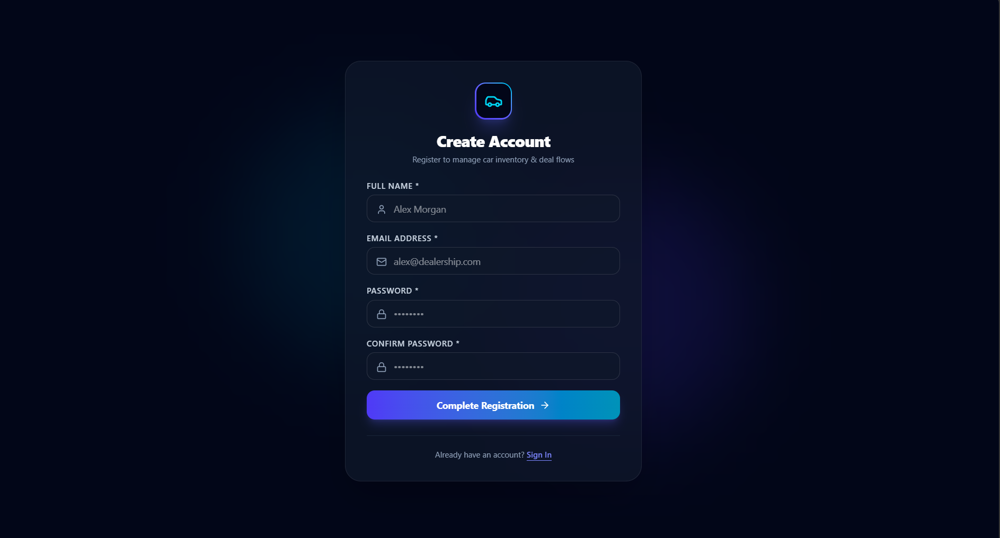
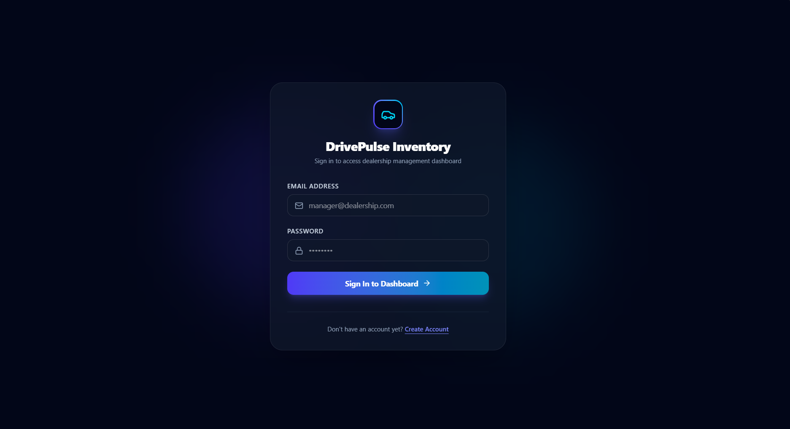
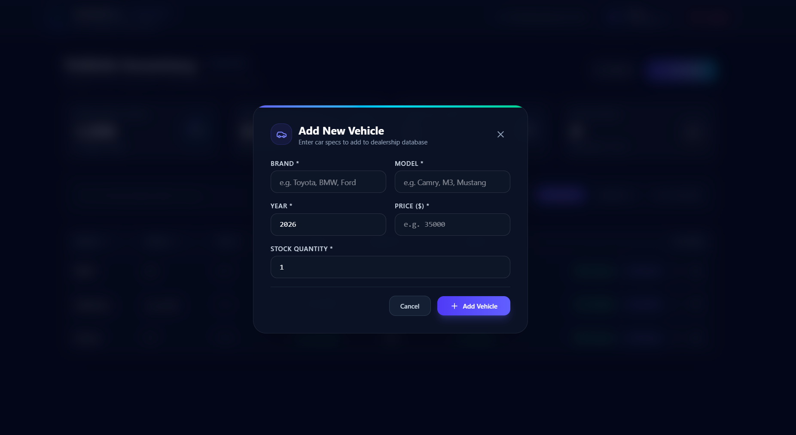

<div align="center">

# 🚗 DrivePulse
### Car Dealership Inventory Management System

*A full-stack inventory management application built using Test Driven Development (TDD).*


</div>

---

# 📖 Overview

DrivePulse is a modern Car Dealership Inventory Management System that enables authenticated users to efficiently manage vehicle inventory through a secure dashboard.

The project was developed following the **Test Driven Development (TDD)** workflow while implementing clean architecture principles and JWT-based authentication.

---

# ✨ Features

## 🔐 Authentication

- User Registration
- Secure Login
- JWT Authentication
- Password Hashing (bcrypt)
- Protected Routes
- Axios Token Interceptor

---

## 🚘 Vehicle Management

- Add New Vehicle
- View Inventory
- Update Vehicle
- Delete Vehicle
- Purchase Vehicle
- Restock Vehicle

---

## 📊 Dashboard

- Inventory Statistics
- Total Inventory Value
- Available Models
- Out-of-stock Counter
- Vehicle Search
- Responsive UI

---

# 🛠 Tech Stack

## Backend

- Node.js
- Express.js
- MongoDB Atlas
- Mongoose
- JWT
- bcrypt
- Jest
- Supertest

## Frontend

- React
- Vite
- Tailwind CSS
- React Router
- Axios

---
# 📸 Sign Up Page



---
# 📸 Login Page



---

# 📊 Dashboard


---

# 🚗 Add Vehicle



# 🏗 Architecture

```
React + Vite
        │
        ▼
Axios
        │
        ▼
Express API
        │
        ▼
JWT Authentication
        │
        ▼
MongoDB Atlas
```

---

# 📂 Project Structure

```
TDD-Kata-Car-Dealership-Inventory-System
│
├── frontend
│   ├── src
│   ├── public
│   ├── package.json
│   └── vite.config.js
│
├── src
│   ├── config
│   ├── controllers
│   ├── middleware
│   ├── models
│   ├── routes
│   ├── services
│   ├── tests
│   ├── utils
│   ├── app.js
│   └── server.js
│
├── README.md
├── PROMPTS.md
└── package.json
```

---

# 🚀 Getting Started

## Clone Repository

```bash
git clone https://github.com/Shivaaansh15/TDD-Kata-Car-Dealership-Inventory-System.git

cd TDD-Kata-Car-Dealership-Inventory-System
```

---

# ⚙ Backend Setup

Install dependencies

```bash
npm install
```

Create a `.env` file

```env
PORT=5000

MONGO_URI=YOUR_MONGODB_CONNECTION_STRING

JWT_SECRET=YOUR_SECRET_KEY
```

Start Backend

```bash
npm start
```

Backend URL

```
http://localhost:5000
```

---

# 💻 Frontend Setup

Open another terminal

```bash
cd frontend

npm install

npm run dev
```

Frontend URL

```
http://localhost:3000
```

---

# 🔑 Authentication Flow

```
Register
      │
      ▼
Login
      │
      ▼
JWT Generated
      │
      ▼
Stored in Local Storage
      │
      ▼
Axios Automatically Adds Token
      │
      ▼
Protected API Access
```

---

# 📡 API Endpoints

## Authentication

| Method | Endpoint | Description |
|---------|----------|-------------|
| POST | `/api/auth/register` | Register User |
| POST | `/api/auth/login` | Login User |

---

## Vehicle APIs

| Method | Endpoint |
|---------|----------|
| GET | `/api/cars` |
| POST | `/api/cars` |
| PUT | `/api/cars/:id` |
| DELETE | `/api/cars/:id` |
| PATCH | `/api/cars/:id/purchase` |
| PATCH | `/api/cars/:id/restock` |

---

# 🧪 Testing

Backend testing was performed using:

- Jest
- Supertest
- Postman (Manual API Validation)

All authentication and inventory endpoints were verified through automated tests and manual API testing.

To execute tests:

```bash
npm test
```

---

# 🔄 TDD Workflow

This project followed the classic Test Driven Development cycle.

```
🔴 RED

Write a failing test

        │
        ▼

🟢 GREEN

Write the minimum implementation

        │
        ▼

🔵 REFACTOR

Improve code while keeping tests green
```

---

# 🤖 My AI Usage

AI tools were used as permitted by the assignment.

### AI Tools Used

- ChatGPT
- Gemini / Antigravity

### How AI Was Used

- Brainstorming architecture
- Generating initial boilerplate
- Debugging backend issues
- Assisting with React component scaffolding
- Writing documentation
- Explaining algorithms and implementation choices

### My Contribution

Every AI-generated suggestion was reviewed, modified where necessary, manually integrated into the project, and verified through testing. The final implementation, debugging, and integration decisions were made during development.

More details are available in **PROMPTS.md**.

---
# ⭐ Key Highlights

- Full Stack MERN Application
- Test Driven Development (TDD)
- JWT Authentication
- RESTful API
- MongoDB Atlas Integration
- Responsive React Dashboard
- CRUD Vehicle Management
- Purchase & Restock Inventory
- Clean Architecture

---

## 🌱 Future Improvements

- Role-Based Access Control
- Vehicle Image Uploads
- Pagination
- Advanced Search & Filters
- Docker Support
- CI/CD Pipeline
- Deployment to Cloud

---

<div align="center">

### Developed by

# **Shivansh Giri**

Computer Science Engineering Student

⭐ Thank you for reviewing this project!

</div>